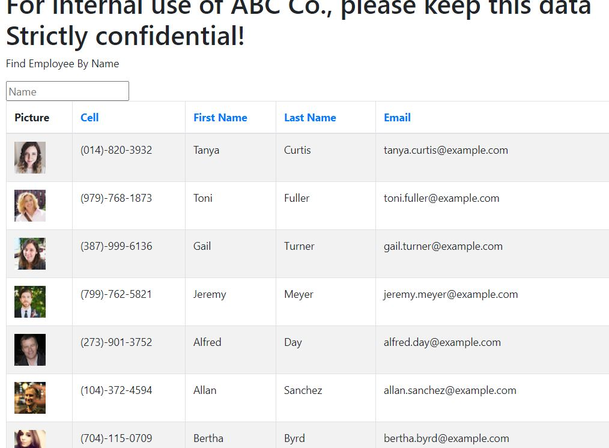
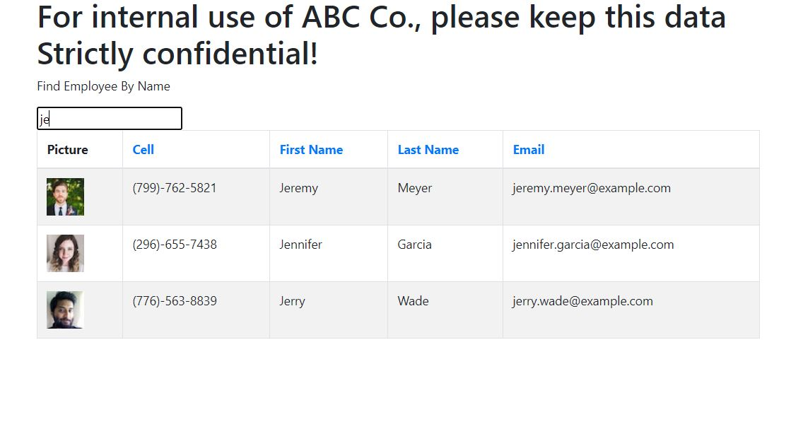

    
# Title : https://github.com/zhim57/user-directory

## Description
Author: Jivko Atanassov

this is top of the line search and sort tool for a top company employee list. Till this moment the company was severely crippled by the suffocating inability of employees to find each other contact info. Now this is resolved and they can searth the list for a particular name or sort by first name last name etc. the company is back on track to conquer the world or world business and nothing can stop them any more.

Github User name: zhim57

## Table of Contents:
- [Title](#title)
- [Description](#description)
- [Table of Contents](#table-of-contents)
- [Installation](#installation)
- [Usage](#usage)
- [License](#licence)
- [Contributing](#contributing)
- [Tests](#tests)
- [Questions](#questions)

## Installation
npm install, npm start from the src directoy
## Usage
- Web development/front end
- Node.js  application
- Web development back end
- Productivity Application
- entertainment application
- other
any organization that has sizeable amount of employees can benefit from this self sorting, self finding list
## Email
zhim57@yahoo.com
## Contributing
the whole bootcamp team , my instructors and google
## License

## Tests
functionality tests

## Questions
please email Jivko Atanassov with any questions at: zhim57@yahoo.com. Thank You.

## Links

[link to this portfolio](https://github.com/zhim57/user-directory)

[link to the deployed application](https://zhim57.github.io/user-directory/)
  

## Screenshots

  